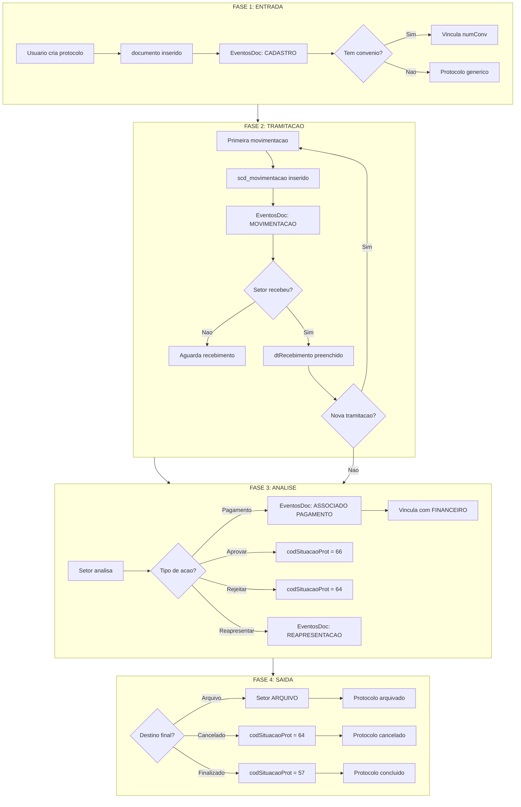

# Ciclo de Vida de Protocolos - Analise Completa

> Gerado em: 2026-01-09 09:42:02
> Modo: SOMENTE LEITURA (SELECT)

---

## 1. Visao Geral do Ciclo de Vida

### 1.1 Etapas do Ciclo de Vida

```
┌─────────────────────────────────────────────────────────────────────────────┐
│                        CICLO DE VIDA DO PROTOCOLO                           │
├─────────────────────────────────────────────────────────────────────────────┤
│                                                                             │
│  ┌──────────┐    ┌──────────────┐    ┌──────────────┐    ┌──────────────┐  │
│  │ ENTRADA  │───►│  TRAMITACAO  │───►│   ANALISE    │───►│    SAIDA     │  │
│  │(Cadastro)│    │(Movimentacao)│    │ (Decisao)    │    │(Arquivamento)│  │
│  └──────────┘    └──────────────┘    └──────────────┘    └──────────────┘  │
│       │                 │                   │                  │           │
│       ▼                 ▼                   ▼                  ▼           │
│   documento       scd_movimentacao    situacaoProtocolo   SETOR.arquivo   │
│   EventosDoc      EventosDoc         EventosDoc          EventosDoc       │
│                                                                             │
└─────────────────────────────────────────────────────────────────────────────┘
```

## 2. FASE 1: ENTRADA (Cadastro do Protocolo)

### 2.1 Pontos de Entrada (Setores que Criam Protocolos)

| Setor de Cadastro                          | Qtd Protocolos | %      |
| ------------------------------------------ | -------------- | ------ |
| SEM SETOR (NULL)                           | 175,613        | 99.99% |
| - RECEPÇÃO                                 | 19             | 0.01%  |
| - GERÊNCIA DE PROJETOS                     | 2              | 0.00%  |
| DESABILITADO SECRETARIA DA SUPERITENDENCIA | 1              | 0.00%  |

### 2.2 Usuarios que Mais Criam Protocolos (Top 15)

| Usuario                                | Qtd Protocolos |
| -------------------------------------- | -------------- |
| MARILIA CARVALHO                       | 31,407         |
| CRISLANNE                              | 29,934         |
| LIVIA PEREIRA CASTRO                   | 18,216         |
| CASSANDRA MENEZES DE BRITO             | 12,439         |
| LUZIANE DA COSTA SILVA                 | 10,434         |
| SHIRLEY RAQUEL DE MOURA ARAUJO AMORIM  | 8,787          |
| NIVEA CABEDO FEITOSA                   | 7,135          |
| WESLLY STANLLEY SOARES DE ARAUJO SILVA | 4,145          |
| LUCIANA GOMES                          | 3,489          |
| BRUNA RAQUEL VALERIO                   | 2,412          |
| PAULA ADRIANA DE SOUSA MELO            | 2,015          |
| PRICYLA SANTOS                         | 1,734          |
| ANALYCE                                | 1,475          |
| MATHEW VILARINHO                       | 1,344          |
| PEDRO AUGUSTO                          | 1,227          |

### 2.3 Tipos de Documento Cadastrados (Assuntos)

| Tipo de Documento (Assunto)                 | Qtd    | %      |
| ------------------------------------------- | ------ | ------ |
| LOTE DE PAGAMENTOS                          | 52,251 | 29.75% |
| SOLICITAÇÃO DE PAGAMENTO DE BOLSA           | 13,811 | 7.86%  |
| SOLICITAÇÃO DE PAGAMENTO DE DIÁRIAS         | 12,509 | 7.12%  |
| BOLSA                                       | 5,707  | 3.25%  |
| SOLICITAÇÃO DE PAGAMENTO PF                 | 5,611  | 3.19%  |
| SOLICITAÇAO DE PAGAMENTO DE DIARIAS         | 5,517  | 3.14%  |
| 33.90.18 - BOLSA                            | 4,566  | 2.60%  |
| SOLICITAÇÃO DE PAGAMENTO - PF               | 4,355  | 2.48%  |
| BOLSAS PESQUISADOR                          | 4,297  | 2.45%  |
| RELATÓRIO DE VIAGEM                         | 4,245  | 2.42%  |
| 33.90.14 - DIÁRIAS                          | 3,880  | 2.21%  |
| SOLICITAÇAO DE PAGAMENTO - PESSOA FISICA    | 3,630  | 2.07%  |
| DIÁRIAS                                     | 2,912  | 1.66%  |
| 33.90.20 - BOLSAS PESQUISADOR               | 2,815  | 1.60%  |
| SOLICITAÇÃO DE PAGAMENTO BOLSA              | 2,398  | 1.37%  |
| SOLICITAÇÃO DE PASSAGEM                     | 2,109  | 1.20%  |
| SOLICITAÇÃO DE SERVIÇOS - PJ                | 1,705  | 0.97%  |
| SOLICITAÇÕES DE PAGAMENTO DE BOLSAS         | 1,428  | 0.81%  |
| SOLICITAÇÃO DE SUPRIMENTO DE FUNDOS         | 1,385  | 0.79%  |
| PRESTAÇÃO DE CONTAS DO SUPRIMENTO DE FUNDOS | 1,317  | 0.75%  |

### 2.4 Remetentes Externos (Origem dos Protocolos)

| Remetente                       | Qtd Protocolos |
| ------------------------------- | -------------- |
| INTERNO (sem remetente)         | 75,099         |
| LIVIA FERNANDA NERY DA SILVA    | 4,841          |
| GILDASIO GUEDES FERNANDES       | 3,740          |
| MARIZE MELO DOS SANTOS          | 3,220          |
| MARIA DA GLORIA DUARTE FERRO    | 3,202          |
| VIRGINIA TAMARA MUNIZ SILVA     | 2,564          |
| LIS CARDOSO MARINHO MEDEIROS    | 2,106          |
| JEAN CARLOS ANTUMES CATAPRETA   | 2,081          |
| MARIA DA GLORIA DUARTE FERRO    | 2,018          |
| JOAO MACEDO DE SOUSA            | 1,746          |
| LOUISE TATIANA MENDES RODRIGUES | 1,715          |
| SEMIRAMIS JAMIL HADAD DO MONTE  | 1,636          |
| MARCIA PERCILIA MOURA PARENTE   | 1,570          |
| LÍVIA FERNANDA NERY DA SILVA    | 1,521          |
| ANDERSON MIRANDA DE SOUZA       | 1,255          |

### 2.5 Protocolos Vinculados a Convenios na Entrada

| Vinculo      | Qtd     | %      |
| ------------ | ------- | ------ |
| Com Convenio | 117,109 | 66.68% |
| Sem Convenio | 58,526  | 33.32% |

## 3. FASE 2: TRAMITACAO (Movimentacao entre Setores)

### 3.1 Volume de Movimentacoes

- **Total de movimentacoes**: 248,325
- **Protocolos distintos com movimentacao**: 123,384
- **Media de movimentacoes por protocolo**: 2.01

### 3.2 Distribuicao de Movimentacoes por Protocolo

| Faixa de Movimentacoes | Qtd Protocolos | %      |
| ---------------------- | -------------- | ------ |
| 1 movimentacao         | 36,725         | 29.76% |
| 2 movimentacoes        | 59,924         | 48.57% |
| 3-5 movimentacoes      | 25,347         | 20.54% |
| 6-10 movimentacoes     | 1,133          | 0.92%  |
| 11-20 movimentacoes    | 180            | 0.15%  |
| 21+ movimentacoes      | 75             | 0.06%  |

### 3.3 Fluxos Mais Comuns (Origem -> Destino)

| Origem                    | Destino                   | Qtd    | %      |
| ------------------------- | ------------------------- | ------ | ------ |
| - GERÊNCIA DE PROJETOS    | - GERENCIA DE FINANÇAS E  | 43,528 | 17.53% |
| - SECRETARIA              | - GERÊNCIA DE PROJETOS    | 35,805 | 14.42% |
| ENTRADA/NULL              | - GERÊNCIA DE PROJETOS    | 20,713 | 8.34%  |
| - GERENCIA DE FINANÇAS E  | - ARQUIVO                 | 13,733 | 5.53%  |
| - GERÊNCIA DE PROJETOS    | DESABILITADO GERÊNCIA ADM | 10,040 | 4.04%  |
| - GERENCIA DE FINANÇAS E  | - ARQUIVO FINANCEIRO      | 9,968  | 4.01%  |
| - RECEPÇÃO                | DESABILITADO GERÊNCIA DE  | 9,809  | 3.95%  |
| - GERÊNCIA DE PROJETOS    | - ARQUIVO GERENCIA DE PRO | 9,404  | 3.79%  |
| DESABILITADO COORDENAÇÃO  | DESABILITADO GERÊNCIA DE  | 8,953  | 3.61%  |
| - RECEPÇÃO                | DESABILITADO COORDENAÇÃO  | 8,716  | 3.51%  |
| - RECEPÇÃO                | - GERÊNCIA DE PROJETOS    | 8,188  | 3.30%  |
| DESABILITADO GERÊNCIA DE  | DESABILITADO GERÊNCIA DE  | 7,634  | 3.07%  |
| - GERÊNCIA DE PROJETOS    | - GERÊNCIA ADMINISTRATIVA | 5,167  | 2.08%  |
| - GERÊNCIA DE PROJETOS    | - GERÊNCIA DE PROJETOS    | 4,554  | 1.83%  |
| DESABILITADO SECRETARIA D | DESABILITADO COORDENAÇÃO  | 3,693  | 1.49%  |
| DESABILITADO SECRETARIA D | DESABILITADO COORDENAÇÃO  | 3,448  | 1.39%  |
| - GERÊNCIA ADMINISTRATIVA | - GERENCIA DE FINANÇAS E  | 3,232  | 1.30%  |
| - GERENCIA DE FINANÇAS E  | - GERÊNCIA ADMINISTRATIVA | 2,944  | 1.19%  |
| DESABILITADO SECRETARIA D | DESABILITADO GERÊNCIA DE  | 2,890  | 1.16%  |
| - RECEPÇÃO                | DESABILITADO GERÊNCIA DE  | 2,642  | 1.06%  |

### 3.4 Tempo Medio em Cada Setor (dias)

| Setor                          | Passagens | Media (dias) | Min | Max (concluido) |
| ------------------------------ | --------- | ------------ | --- | --------------- |
| DESABILITADO GERÊNCIA ADMINIST | 11,473    | 1608         | 0   | 954             |
| DESABILITADO SECRETARIA DA SUP | 101       | 1403         | 0   | 29              |
| DESABILITADO COORDENAÇÃO DE RE | 237       | 1053         | 0   | 22              |
| DESABILITADO COORDENAÇÃO DE CO | 170       | 796          | 0   | 362             |
| DESABILITADO GERÊNCIA DE ADMIN | 744       | 532          | 0   | 580             |
| DESABILITADO COORDENAÇÃO DE AD | 869       | 459          | 0   | 36              |
| DESABILITADO GERÊNCIA DE CONTA | 113       | 440          | 0   | 441             |
| - GERENCIA DE FINANÇAS E CONTA | 49,247    | 339          | 0   | 661             |
| - ARQUIVO                      | 17,533    | 334          | 0   | 181             |
| - ARQUIVO FINANCEIRO           | 10,027    | 265          | 0   | 135             |
| - ARQUIVO ADMINISTRATIVO       | 1,741     | 259          | 0   | 143             |
| - ARQUIVO GERENCIA DE PROJETOS | 9,526     | 259          | 0   | 141             |
| - GERÊNCIA ADMINISTRATIVA      | 9,802     | 199          | 0   | 1399            |
| - GERÊNCIA DE PROJETOS         | 73,477    | 104          | 0   | 1861            |
| - ASSESSORIA TÉCNICA / JURIDIC | 1,357     | 51           | 0   | 207             |

### 3.5 Usuarios que Mais Tramitam (Despachantes)

| Usuario                               | Qtd Movimentacoes |
| ------------------------------------- | ----------------- |
| CRISLANNE                             | 29,262            |
| USUARIO NAO IDENTIFICADO              | 22,693            |
| BRUNA RAQUEL VALERIO                  | 18,416            |
| LIVIA PEREIRA CASTRO                  | 18,250            |
| LUCIANA V. BATISTA                    | 14,539            |
| CASSANDRA MENEZES DE BRITO            | 12,293            |
| LUZIANE DA COSTA SILVA                | 10,809            |
| PRICYLA SANTOS                        | 8,842             |
| SHIRLEY RAQUEL DE MOURA ARAUJO AMORIM | 8,654             |
| NAYDSON DOS SANTOS SILVA              | 8,583             |
| MISAEL DE CARVALHO SOUSA              | 8,292             |
| NIVEA CABEDO FEITOSA                  | 7,691             |
| MATUSALA RODRIGUES SILVA              | 7,149             |
| LUANA SILVA                           | 6,915             |
| ANTONIA MESQUITA                      | 6,124             |

## 4. FASE 3: ANALISE (Situacoes e Decisoes)

### 4.1 Tabela de Situacoes Disponiveis

| Codigo | Situacao                                           | Qtd Uso |
| ------ | -------------------------------------------------- | ------- |
| 66     | EM ANÁLISE                                         | 21,408  |
| 64     | CANCELADO                                          | 49      |
| 61     | PAGAMENTO                                          | 18      |
| 56     | APROVADO                                           | 14      |
| 11     | AGUARDANDO ENTRADA DE RECURSOS                     | 6       |
| 60     | ARQUIVADO                                          | 5       |
| 53     | REALIZANDO COTAÇÃO DE PREÇO                        | 3       |
| 65     | ENCAMINHADO PARA JURIDICO                          | 3       |
| 37     | AGENDADA REALIZAÇÃO DO CERTAME                     | 3       |
| 33     | ENCAMINHADO PARA PARECER DO JURÍDICO               | 2       |
| 27     | PROCESSO PENDENTE                                  | 2       |
| 3      | PROPOSTA EM FASE DE ELABORAÇÃO                     | 2       |
| 68     | AGUARDANDO REMANEJAMENTO                           | 2       |
| 54     | PUBLICAÇÃO INEXIGIBILIDADE DE LICITAÇÃO            | 1       |
| 43     | EM AJUSTES DO CONTRATO                             | 1       |
| 17     | AGUARDANDO ENVIO/CORREÇÃO DE DADOS BANCÁRIOS       | 1       |
| 22     | PROCESSO EM ANÁLISE                                | 1       |
| 23     | REMANEJAMENTO EM FASE DE ELABORAÇÃO                | 0       |
| 24     | REMANEJAMENTO ENCAMINHADO AO ÓRGÃO FINANCIADOR, EM | 0       |
| 25     | REMANEJAMENTO EM ANÁLISE DO ÓRGÃO FINANCIADOR      | 0       |
| 26     | AGUARDANDO PEDIDO DE REMANEJAMENTO                 | 0       |
| 28     | RECEBIDO PELA EQUIPE DE LICITAÇÃO                  | 0       |
| 29     | EM ANÁLISE NO SETOR DE LICITAÇÃO                   | 0       |
| 30     | EM ELABORAÇÃO DO EDITAL                            | 0       |
| 31     | ENCAMINHADO EDITAL PARA PARECER DO COORDENADOR     | 0       |
| 32     | RECEBIDO PARECER DO COORDENADOR                    | 0       |
| 34     | RECEBIDO PARECER DO JURÍDICO                       | 0       |
| 35     | EM AJUSTES DO EDITAL                               | 0       |
| 36     | EM PUBLICAÇÃO DO EDITAL                            | 0       |
| 38     | ENCERRRADO CERTAME ENCAMINHADO PARA PARECER DO COO | 0       |
| 39     | RECEBIDO PARECER DO COORDENADOR DA(S) PROPOSTA(S)  | 0       |
| 40     | EM PROCESSO DE HOMOLOGAÇÃO DA(S) EMPRESA(S) VENCED | 0       |
| 41     | EM PUBLICAÇÃO DA EMPRESA(S) VENCEDORA(S)           | 0       |
| 42     | EM ELABORAÇÃO DO CONTRATO                          | 0       |
| 18     | AGUARDANDO PRORROGAÇÃO DA VIGÊNCIA DO PROJETO      | 0       |
| 19     | AGUARDANDO APROVAÇÃO DO TERMO ADITIVO              | 0       |
| 20     | AGUARDANDO APROVAÇÃO DO APOSTILAMENTO              | 0       |
| 21     | AGUARDANDO AUTORIZAÇÃO DA COORDENAÇÃO EXECUTIVA DA | 0       |
| 12     | AGUARDANDO INFORMAÇÃO DE META/ETAPA                | 0       |
| 13     | AGUARDANDO AJUSTE DA PROPOSTA ORÇAMENTÁRIA         | 0       |
| 14     | AGUARDANDO ENVIO/CORREÇÃO DO CIM                   | 0       |
| 15     | AGUARDANDO ENVIO DO Nº PIS/PASEP                   | 0       |
| 16     | AGUARDANDO ENVIO DO Nº CPF                         | 0       |
| 4      | PROJETO/PROPOSTA AGUARDANDO POSICIONAMENTO DO COOR | 0       |
| 5      | PROPOSTA SUBMETIDA AO ÓRGÃO FINANCIADOR PARA APROV | 0       |
| 6      | PROPOSTA SUBMETIDA À UFPE, ATRAVÉS DO PROCESSO Nº  | 0       |
| 7      | PROPOSTA EM FASE DE ASSINATURA FADE                | 0       |
| 8      | PROJETO SUBMETIDO À APROVAÇÃO DA COORDENAÇÃO EXECU | 0       |
| 9      | PROJETO PENDENTE                                   | 0       |
| 10     | PROJETO LIBERADO PARA EXECUÇÃO                     | 0       |
| 44     | EM PUBLICAÇÃO DO CONTRATO                          | 0       |
| 45     | EM ASSINATURA DO CONTRATO PELA FADE                | 0       |
| 46     | EM ASSINATURA DO CONTRATO PELA FORNECEDOR(ES)      | 0       |
| 47     | AGUARDANDO ACEITO DO PEDIDO DE CARONA PELO FORNECE | 0       |
| 48     | AGUARDANDO ACEITO DO PEDIDO DE CARONA DO ÓRGÃO GER | 0       |
| 49     | AGUARDANDO PROPOSTA DA EMPRESA VENCEDORA DO CERTAM | 0       |
| 50     | AGUARDANDO DOCUMENTAÇÃO DE HABILITAÇÃO DA EMPRESA  | 0       |
| 51     | RECEBIDA PROPOSTA DA EMPRESA VENCEDORA DO CERTAME  | 0       |
| 52     | RECEBIDA DOCUMENTAÇÃO DE HABILIATAÇÃO DA EMPRESA V | 0       |
| 55     | PUBLICAÇÃO DISPENSA DE LICITAÇÃO                   | 0       |
| 2      | PROPOSTA EM ANÁLISE                                | 0       |
| 57     | FINALIZADO                                         | 0       |
| 58     | AVALIAÇÃO E AUTORIZAÇÃO                            | 0       |
| 59     | LIBERADO                                           | 0       |
| 69     | Em Análise                                         | 0       |
| 70     | SOLICITAÇÃO SUBSTITUÍDA E ALTERADO PROTOCOLO       | 0       |
| 67     | AGUARDANDO ENVIO DA NOTA FISCAL                    | 0       |
| 62     | RECEBIDO/ ENVIADO PARA ANÁLISE                     | 0       |
| 63     | EM COTAÇÃO                                         | 0       |

### 4.2 Distribuicao de Situacoes nas Movimentacoes

| Situacao                                 | Qtd     | %      |
| ---------------------------------------- | ------- | ------ |
| NULL/Indefinido                          | 226,804 | 91.33% |
| EM ANÁLISE                               | 21,408  | 8.62%  |
| CANCELADO                                | 49      | 0.02%  |
| PAGAMENTO                                | 18      | 0.01%  |
| APROVADO                                 | 14      | 0.01%  |
| AGUARDANDO ENTRADA DE RECURSOS           | 6       | 0.00%  |
| ARQUIVADO                                | 5       | 0.00%  |
| REALIZANDO COTAÇÃO DE PREÇO              | 3       | 0.00%  |
| ENCAMINHADO PARA JURIDICO                | 3       | 0.00%  |
| AGENDADA REALIZAÇÃO DO CERTAME           | 3       | 0.00%  |
| PROPOSTA EM FASE DE ELABORAÇÃO           | 2       | 0.00%  |
| AGUARDANDO REMANEJAMENTO                 | 2       | 0.00%  |
| ENCAMINHADO PARA PARECER DO JURÍDICO     | 2       | 0.00%  |
| PROCESSO PENDENTE                        | 2       | 0.00%  |
| PUBLICAÇÃO INEXIGIBILIDADE DE LICITAÇÃO  | 1       | 0.00%  |
| EM AJUSTES DO CONTRATO                   | 1       | 0.00%  |
| AGUARDANDO ENVIO/CORREÇÃO DE DADOS BANCÁ | 1       | 0.00%  |
| PROCESSO EM ANÁLISE                      | 1       | 0.00%  |

### 4.3 Evolucao de Situacoes por Ano

| Ano  | Em Analise | Arquivado | Cancelado | Pagamento | Indefinido |
| ---- | ---------- | --------- | --------- | --------- | ---------- |
| 2025 | 20,071     | 0         | 10        | 0         | 65,823     |
| 2024 | 1,323      | 1         | 36        | 13        | 49,092     |
| 2023 | 13         | 0         | 0         | 3         | 19,587     |
| 2022 | 1          | 0         | 0         | 2         | 13,652     |
| 2021 | 0          | 1         | 3         | 0         | 9,316      |
| 2020 | 0          | 3         | 0         | 0         | 8,735      |

## 5. FASE 4: SAIDA (Arquivamento e Conclusao)

### 5.1 Setores de Arquivo

| Codigo | Setor                          | Flag Arquivo |
| ------ | ------------------------------ | ------------ |
| 52     | - ARQUIVO                      | Nao          |
| 55     | - ARQUIVO ADMINISTRATIVO       | Nao          |
| 54     | - ARQUIVO FINANCEIRO           | Nao          |
| 53     | - ARQUIVO GERENCIA DE PROJETOS | Nao          |

### 5.2 Protocolos por Tipo de Saida

| Tipo de Saida                                      | Qtd    | %      |
| -------------------------------------------------- | ------ | ------ |
| EM TRAMITACAO (- GERENCIA DE FINANÇAS E CONTABILID | 21,827 | 17.69% |
| EM TRAMITACAO (DESABILITADO GERÊNCIA DE ADMINISTRA | 18,948 | 15.36% |
| ARQUIVADO (- ARQUIVO)                              | 17,255 | 13.98% |
| EM TRAMITACAO (DESABILITADO GERÊNCIA ADMINISTRATIV | 11,258 | 9.12%  |
| EM TRAMITACAO (- GERÊNCIA DE PROJETOS)             | 10,650 | 8.63%  |
| ARQUIVADO (- ARQUIVO FINANCEIRO)                   | 9,814  | 7.95%  |
| ARQUIVADO (- ARQUIVO GERENCIA DE PROJETOS)         | 9,196  | 7.45%  |
| EM TRAMITACAO (DESABILITADO GERÊNCIA DE PROJETOS E | 5,554  | 4.50%  |
| EM TRAMITACAO (DESABILITADO COORDENAÇÃO DE RECURSO | 5,029  | 4.08%  |
| EM TRAMITACAO (DESABILITADO COORDENAÇÃO DE ADM DE  | 4,078  | 3.31%  |
| EM TRAMITACAO (- GERÊNCIA ADMINISTRATIVA)          | 2,198  | 1.78%  |
| ARQUIVADO (- ARQUIVO ADMINISTRATIVO)               | 1,667  | 1.35%  |
| EM TRAMITACAO (DESABILITADO SECRETARIA DA SUPERITE | 1,245  | 1.01%  |
| EM TRAMITACAO (NULL)                               | 1,207  | 0.98%  |
| EM TRAMITACAO (DESABILITADO COORD DE BOLSAS, EST E | 1,002  | 0.81%  |
| EM TRAMITACAO (DESABILITADO COORDENAÇÃO DE FINANÇA | 618    | 0.50%  |
| EM TRAMITACAO (- RECEPÇÃO)                         | 491    | 0.40%  |
| EM TRAMITACAO (COORDENAÇÃO DE CONTABILIDADE)       | 298    | 0.24%  |
| EM TRAMITACAO (DESABILITADO CONTABILIDADE UFPI)    | 250    | 0.20%  |
| EM TRAMITACAO (DESABILITADO COORDENAÇÃO DE COMPRAS | 161    | 0.13%  |

### 5.3 Tempo Total do Ciclo de Vida (Criacao -> Arquivamento)

| Tempo Ciclo de Vida | Qtd   | %      |
| ------------------- | ----- | ------ |
| 0-7 dias            | 5,416 | 14.23% |
| 8-30 dias           | 8,050 | 21.15% |
| 31-90 dias          | 7,593 | 19.95% |
| 91-180 dias         | 3,676 | 9.66%  |
| 181-365 dias        | 7,517 | 19.75% |
| 365+ dias           | 5,817 | 15.28% |

### 5.4 Protocolos Ainda Nao Concluidos (Pendentes)

| Setor Atual                         | Qtd Pendentes | Media Dias Parado |
| ----------------------------------- | ------------- | ----------------- |
| - GERENCIA DE FINANÇAS E CONTABILID | 21,827        | 609               |
| DESABILITADO GERÊNCIA DE ADMINISTRA | 18,948        | 3349              |
| DESABILITADO GERÊNCIA ADMINISTRATIV | 11,262        | 1639              |
| - GERÊNCIA DE PROJETOS              | 10,653        | 522               |
| DESABILITADO GERÊNCIA DE PROJETOS E | 5,554         | 3385              |
| DESABILITADO COORDENAÇÃO DE RECURSO | 5,029         | 2673              |
| DESABILITADO COORDENAÇÃO DE ADM DE  | 4,078         | 2836              |
| - GERÊNCIA ADMINISTRATIVA           | 2,198         | 568               |
| DESABILITADO SECRETARIA DA SUPERITE | 1,245         | 3062              |
| DESABILITADO COORD DE BOLSAS, EST E | 1,002         | 3695              |
| DESABILITADO COORDENAÇÃO DE FINANÇA | 618           | 3043              |
| - RECEPÇÃO                          | 491           | 3724              |
| COORDENAÇÃO DE CONTABILIDADE        | 298           | 4006              |
| DESABILITADO CONTABILIDADE UFPI     | 250           | 4176              |
| DESABILITADO COORDENAÇÃO DE COMPRAS | 161           | 2430              |
| - ASSESSORIA TÉCNICA / JURIDICA     | 122           | 1672              |
| 02 - ARQUIVAMENTO SAGI              | 93            | 445               |
| DESABILITADO COODENAÇÃO DE PLANEJAM | 92            | 3999              |
| - SUPERINTENDENCIA                  | 72            | 2146              |
| DESABILITADO CLSP                   | 61            | 2570              |

## 6. EVENTOS Durante o Ciclo de Vida

### 6.1 Tipos de Eventos (EventosDoc)

| Tipo de Evento         | Qtd     | %      |
| ---------------------- | ------- | ------ |
| ASSOCIADO AO PAGAMENTO | 212,031 | 53.02% |
| OUTRO                  | 162,641 | 40.67% |
| CADASTRO INICIAL       | 21,407  | 5.35%  |
| FOI REAPRESENTADO      | 1,755   | 0.44%  |
| CANCELAMENTO           | 1,505   | 0.38%  |
| ARQUIVAMENTO           | 534     | 0.13%  |
| TRANSFERENCIA          | 3       | 0.00%  |

### 6.2 Vinculos com Financeiro (Pagamentos)

- **Protocolos com vinculo de pagamento**: 58,174 (33.1%)
- **Total de vinculos de pagamento**: 212,031
- **Media de pagamentos por protocolo vinculado**: 3.6

## 7. Exemplo: Ciclo de Vida de um Protocolo Real

### Protocolo: 0153.210624.0032

**Assunto**: SOLICITAÇÃO DE SERVIÇOS - PJ

#### Historico de Movimentacoes

| #   | Data       | Hora  | Origem               | Destino              | Situacao     | Recebido | Usuario              |
| --- | ---------- | ----- | -------------------- | -------------------- | ------------ | -------- | -------------------- |
| 1   | 21/06/2024 | 11:13 | - SECRETARIA         | - GERÊNCIA DE PROJET | NAO DEFINIDA | Sim      | CRISLANNE            |
| 2   | 28/06/2024 | 16:16 | - GERÊNCIA DE PROJET | - GERÊNCIA ADMINISTR | NAO DEFINIDA | Sim      | PRICYLA SANTOS       |
| 3   | 29/07/2024 | 16:17 | - GERÊNCIA ADMINISTR | - ASSESSORIA TÉCNICA | NAO DEFINIDA | Nao      | HITALO               |
| 4   | 30/07/2024 | 10:55 | - ASSESSORIA TÉCNICA | - GERÊNCIA ADMINISTR | NAO DEFINIDA | Sim      | FLÁVIO SOARES DA SIL |
| 5   | 04/09/2024 | 10:55 | - GERÊNCIA ADMINISTR | - GERENCIA DE FINANÇ | NAO DEFINIDA | Sim      | HITALO               |
| 6   | 06/09/2024 | 10:27 | - GERENCIA DE FINANÇ | - GERÊNCIA ADMINISTR | NAO DEFINIDA | Sim      | PEDRO AUGUSTO        |
| 7   | 17/09/2024 | 11:56 | - GERÊNCIA ADMINISTR | - ARQUIVO            | NAO DEFINIDA | Sim      | HITALO               |

#### Eventos do Protocolo

| Data       | Evento                                                 |
| ---------- | ------------------------------------------------------ |
| 28/06/2024 | CONFIRMAÇÃO DA RECEPÇÃO DO PROTOCOLO/PROCESSO EFETUADA |
| 09/07/2024 | CONFIRMAÇÃO DA RECEPÇÃO DO PROTOCOLO/PROCESSO EFETUADA |
| 30/07/2024 | CONFIRMAÇÃO DA RECEPÇÃO DO PROTOCOLO/PROCESSO EFETUADA |
| 04/09/2024 | CONFIRMAÇÃO DA RECEPÇÃO DO PROTOCOLO/PROCESSO EFETUADA |
| 06/09/2024 | CONFIRMAÇÃO DA RECEPÇÃO DO PROTOCOLO/PROCESSO EFETUADA |
| 17/09/2024 | CONFIRMAÇÃO DA RECEPÇÃO DO PROTOCOLO/PROCESSO EFETUADA |

## 8. Fluxograma Detalhado do Ciclo de Vida



## 9. Queries Uteis para Analise do Ciclo de Vida

### 9.1 Rastrear Ciclo Completo de um Protocolo

```sql
DECLARE @NumeroProtocolo VARCHAR(50) = '0153.250325.0049';

-- 1. Dados do protocolo
SELECT
    d.numero, d.assunto, d.data AS data_criacao,
    u.NOME AS criado_por, d.remetente, d.numConv
FROM documento d
LEFT JOIN USUARIO u ON d.codUsuario = u.CODIGO
WHERE d.numero = @NumeroProtocolo;

-- 2. Historico de movimentacoes
SELECT
    ROW_NUMBER() OVER (ORDER BY m.data, m.hora) AS seq,
    m.data, m.hora,
    so.DESCR AS origem, sd.DESCR AS destino,
    sp.descricao AS situacao,
    m.dtRecebimento, u.NOME AS despachante
FROM scd_movimentacao m
LEFT JOIN SETOR so ON m.codSetorOrigem = so.CODIGO
LEFT JOIN SETOR sd ON m.codSetorDestino = sd.CODIGO
LEFT JOIN situacaoProtocolo sp ON m.codSituacaoProt = sp.codigo
LEFT JOIN USUARIO u ON m.codUsuario = u.CODIGO
WHERE m.numDocumento = @NumeroProtocolo
    AND (m.Deletado IS NULL OR m.Deletado = 0)
ORDER BY m.data, m.hora;

-- 3. Eventos (incluindo pagamentos)
SELECT e.Data, e.Descricao
FROM EventosDoc e
INNER JOIN documento d ON e.CodProt = d.Codigo
WHERE d.numero = @NumeroProtocolo
    AND (e.deletado IS NULL OR e.deletado = 0)
ORDER BY e.Data;
```

### 9.2 Protocolos em Cada Fase

```sql
WITH UltimaMovimentacao AS (
    SELECT
        m.CodProt,
        m.codSetorDestino,
        m.codSituacaoProt,
        m.data AS ultima_data,
        ROW_NUMBER() OVER (PARTITION BY m.CodProt ORDER BY m.data DESC, m.codigo DESC) AS rn
    FROM scd_movimentacao m
    WHERE (m.Deletado IS NULL OR m.Deletado = 0)
)
SELECT
    CASE
        WHEN s.DESCR LIKE '%ARQUIVO%' THEN 'ARQUIVADO'
        WHEN um.codSituacaoProt IN (64, 57) THEN 'FINALIZADO'
        WHEN s.DESCR LIKE '%FINANC%' THEN 'EM FINANCEIRO'
        WHEN s.DESCR LIKE '%PROJET%' THEN 'EM PROJETOS'
        WHEN s.DESCR LIKE '%SECRET%' OR s.DESCR LIKE '%RECEP%' THEN 'EM RECEPCAO'
        ELSE 'EM TRAMITACAO'
    END AS fase,
    COUNT(*) AS qtd
FROM UltimaMovimentacao um
LEFT JOIN SETOR s ON um.codSetorDestino = s.CODIGO
WHERE um.rn = 1
GROUP BY CASE
        WHEN s.DESCR LIKE '%ARQUIVO%' THEN 'ARQUIVADO'
        WHEN um.codSituacaoProt IN (64, 57) THEN 'FINALIZADO'
        WHEN s.DESCR LIKE '%FINANC%' THEN 'EM FINANCEIRO'
        WHEN s.DESCR LIKE '%PROJET%' THEN 'EM PROJETOS'
        WHEN s.DESCR LIKE '%SECRET%' OR s.DESCR LIKE '%RECEP%' THEN 'EM RECEPCAO'
        ELSE 'EM TRAMITACAO'
    END
ORDER BY COUNT(*) DESC;
```
