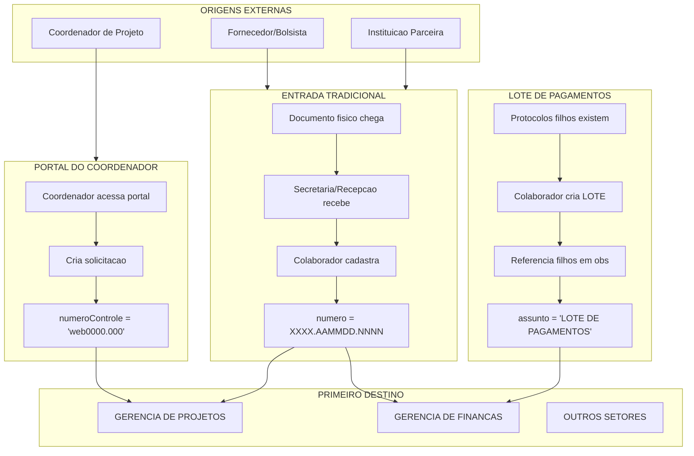

# Investigacao: Pontos de Entrada de Protocolos

> Gerado em: 2026-01-09 10:31:49
> Modo: SOMENTE LEITURA (SELECT)

---

## 1. Resumo das Origens de Protocolos

```
┌─────────────────────────────────────────────────────────────────────────────┐
│                     PONTOS DE ENTRADA DE PROTOCOLOS                         │
├─────────────────────────────────────────────────────────────────────────────┤
│                                                                             │
│  1. PORTAL DO COORDENADOR (apos 2022)                                      │
│     - Coordenador externo cria solicitacoes                                │
│     - Colaborador FADEX tambem pode criar                                  │
│     - Identificador: numeroControle = 'web0000.000'                        │
│                                                                             │
│  2. SECRETARIA / PROJETOS (entrada tradicional)                            │
│     - Entrada fisica de documentos                                         │
│     - Colaboradores FADEX cadastram                                        │
│     - Numero padrao: XXXX.AAMMDD.NNNN                                      │
│                                                                             │
│  3. PROTOCOLO MAE (Lote de Pagamentos)                                     │
│     - Agrupa protocolos filhos do mesmo tipo/projeto                       │
│     - Criado por colaborador do setor                                      │
│     - Vinculo via texto em observacao                                      │
│                                                                             │
└─────────────────────────────────────────────────────────────────────────────┘
```

## 2. PORTAL DO COORDENADOR (numeroControle = 'web%')

### 2.1 Volume de Protocolos do Portal

| Metrica                       | Valor                      |
| ----------------------------- | -------------------------- |
| Total de protocolos do Portal | **1,783**                  |
| % do total geral              | **1.02%**                  |
| Primeiro protocolo            | 2023-08-25 09:46:32.313000 |
| Ultimo protocolo              | 2025-09-05 18:22:53.523000 |

### 2.2 Evolucao Anual do Portal do Coordenador

| Ano  | Protocolos | Convenios Distintos |
| ---- | ---------- | ------------------- |
| 2023 | 7          | 1                   |
| 2024 | 150        | 22                  |
| 2025 | 1,626      | 86                  |

### 2.3 Tipos de Solicitacao do Portal (Assuntos)

| Tipo de Solicitacao                                | Qtd | %      |
| -------------------------------------------------- | --- | ------ |
| 33.90.39 - OUTROS SERVIÇOS DE TERCEIROS PESSOA JUR | 638 | 35.78% |
| 33.90.33 - PASSAGENS E DESPESAS COM LOCOMOÇÃO      | 600 | 33.65% |
| 33.90.30 - MATERIAL DE CONSUMO                     | 224 | 12.56% |
| 44.90.52 - EQUIPAMENTOS E MATERIAL PERMANENTE      | 121 | 6.79%  |
| 33.00.39 - OUTROS SERVIÇOS DE TERCEIROS - PESSOA J | 82  | 4.60%  |
| 33.90.36 - OUTROS SERVIÇOS DE TERCEIROS PESSOA FÍS | 23  | 1.29%  |
| NULL                                               | 15  | 0.84%  |
| 33.90.14 - DIÁRIAS                                 | 9   | 0.50%  |
| SOLICITAÇÃO DE SERVIÇOS - PJ                       | 9   | 0.50%  |
| 33.00.36 - OUTROS SERVIÇOS DE TERCEIROS PESSOA FÍS | 8   | 0.45%  |
| 33.90.40 - SERVIÇOS DE TECNOLOGIA DA INFORMAÇÃO E  | 7   | 0.39%  |
| 33.90.10 - RESERVA TÉCNICA                         | 6   | 0.34%  |
| SOLICITAÇÃO DE COMPRA MAT PERMANENTE               | 6   | 0.34%  |
| SOLICITAÇÃO DE COMPRAS/CONSUMO                     | 6   | 0.34%  |
| SOLICITAÇÃO DE PASSAGEM                            | 6   | 0.34%  |
| 33.90.20 - BOLSAS PESQUISADOR                      | 5   | 0.28%  |
| Receitas - Receitas                                | 4   | 0.22%  |
| 33.90.18 - BOLSA                                   | 3   | 0.17%  |
| 33.00.30 - MATERIAL DE CONSUMO                     | 3   | 0.17%  |
| 44.00.52 - EQUIPAMENTO E MATERIAL PERMANENTE       | 3   | 0.17%  |

### 2.4 Usuarios que Criam Protocolos no Portal

| Usuario                  | Qtd Protocolos |
| ------------------------ | -------------- |
| USUARIO NAO IDENTIFICADO | 1,783          |

### 2.5 Remetentes do Portal (Coordenadores)

| Coordenador/Remetente                  | Qtd Protocolos |
| -------------------------------------- | -------------- |
| NULL                                   | 1,650          |
| MAKFFERISMAR REGO DOS SANTOS           | 45             |
| FERNANDO SILVEIRA ALVES                | 22             |
| LIS CARDOSO MARINHO MEDEIROS           | 8              |
| GEORGIANA EURIDES DE CARVALHO MARQUES  | 8              |
| FRANCISCO DE ASSIS DE SOUSA NASCIMENTO | 6              |
| ADRIANA MONTEIRO SANTOS                | 5              |
| HUMBERTO ARRUDA GUIMARÃES              | 5              |
| STEFÂNIA CABRAL PEDRA                  | 3              |
| RENÉ GERALDO CORDEIRO SILVA JÚNIOR     | 3              |
| MARTA MARIA AZEVEDO QUEIROZ            | 3              |
| ANDERSON MIRANDA DE SOUSA              | 3              |
| ANA LYS BEZERRA BARRADAS MINEIRO       | 3              |
| ANTONIO OSEAS DE CARVALHO FILHO        | 2              |
| DIEGO ALBERT BRITO DE MELO             | 2              |

### 2.6 Fluxo dos Protocolos do Portal (Primeira Movimentacao)

| Primeiro Destino                    | Qtd   | %      |
| ----------------------------------- | ----- | ------ |
| - GERÊNCIA DE PROJETOS              | 1,739 | 97.53% |
| DESABILITADO COORDENAÇÃO DE COMPRAS | 43    | 2.41%  |
| - GERÊNCIA ADMINISTRATIVA           | 1     | 0.06%  |

### 2.7 Exemplo de Protocolo do Portal

| Numero           | NumeroControle | Assunto                   | Data       | Remetente | Convenio |
| ---------------- | -------------- | ------------------------- | ---------- | --------- | -------- |
| 3841.050925.0005 | WEB:20030/2025 | 33.90.30 - MATERIAL DE CO | 05/09/2025 | NULL      | 3549832  |
| 3841.050925.0004 | WEB:20017/2025 | 33.90.30 - MATERIAL DE CO | 05/09/2025 | NULL      | 3549832  |
| 3841.050925.0003 | WEB:20012/2025 | 33.90.30 - MATERIAL DE CO | 05/09/2025 | NULL      | 3549832  |
| 3841.050925.0002 | WEB:20011/2025 | 33.90.30 - MATERIAL DE CO | 05/09/2025 | NULL      | 3549832  |
| 3841.050925.0001 | WEB:20010/2025 | 33.90.30 - MATERIAL DE CO | 05/09/2025 | NULL      | 3549832  |

## 3. ENTRADA TRADICIONAL (Secretaria/Projetos)

### 3.1 Volume de Protocolos Tradicionais

- **Total de protocolos tradicionais**: 173,852 (98.98%)

### 3.2 Setores que Mais Recebem Primeira Movimentacao (Entrada)

| Setor de Origem (Entrada)           | Qtd    | %      |
| ----------------------------------- | ------ | ------ |
| - SECRETARIA                        | 40,576 | 33.37% |
| - RECEPÇÃO                          | 34,931 | 28.73% |
| ENTRADA DIRETA (NULL)               | 19,310 | 15.88% |
| DESABILITADO SECRETARIA DA SUPERITE | 14,251 | 11.72% |
| - GERÊNCIA DE PROJETOS              | 10,354 | 8.51%  |
| DESABILITADO GERÊNCIA ADMINISTRATIV | 520    | 0.43%  |
| - GERENCIA DE FINANÇAS E CONTABILID | 431    | 0.35%  |
| DESABILITADO COORDENAÇÃO DE RECURSO | 423    | 0.35%  |
| DESABILITADO GERÊNCIA DE ADMINISTRA | 359    | 0.30%  |
| - GERÊNCIA ADMINISTRATIVA           | 306    | 0.25%  |
| COORDENAÇÃO DE CONTABILIDADE        | 35     | 0.03%  |
| DESABILITADO COORDENAÇÃO DE FINANÇA | 32     | 0.03%  |
| - ASSESSORIA TÉCNICA / TI           | 16     | 0.01%  |
| - ASSESSORIA TÉCNICA / JURIDICA     | 13     | 0.01%  |
| DESABILITADO COORDENAÇÃO DE COMPRAS | 11     | 0.01%  |

### 3.3 Evolucao: Tradicional vs Portal por Ano

| Ano  | Portal | Tradicional | % Portal |
| ---- | ------ | ----------- | -------- |
| 2018 | 0      | 12,050      | 0.0%     |
| 2019 | 0      | 11,102      | 0.0%     |
| 2020 | 0      | 7,167       | 0.0%     |
| 2021 | 0      | 8,250       | 0.0%     |
| 2022 | 0      | 11,839      | 0.0%     |
| 2023 | 7      | 15,997      | 0.0%     |
| 2024 | 150    | 32,648      | 0.5%     |
| 2025 | 1,626  | 39,154      | 4.0%     |
| 2026 | 0      | 6           | 0.0%     |
| 2027 | 0      | 4           | 0.0%     |
| 2028 | 0      | 1           | 0.0%     |
| 2032 | 0      | 1           | 0.0%     |
| 2033 | 0      | 1           | 0.0%     |
| 2048 | 0      | 1           | 0.0%     |
| 2052 | 0      | 2           | 0.0%     |
| 2054 | 0      | 1           | 0.0%     |
| 2109 | 0      | 1           | 0.0%     |
| 2201 | 0      | 12          | 0.0%     |
| 2202 | 0      | 12          | 0.0%     |
| 2203 | 0      | 1           | 0.0%     |
| 2204 | 0      | 20          | 0.0%     |
| 2205 | 0      | 10          | 0.0%     |
| 2207 | 0      | 1           | 0.0%     |
| 2208 | 0      | 2           | 0.0%     |
| 2209 | 0      | 6           | 0.0%     |
| 2215 | 0      | 1           | 0.0%     |
| 2216 | 0      | 1           | 0.0%     |
| 2217 | 0      | 6           | 0.0%     |
| 2219 | 0      | 2           | 0.0%     |
| 2225 | 0      | 1           | 0.0%     |
| 2233 | 0      | 1           | 0.0%     |
| 2501 | 0      | 1           | 0.0%     |
| 3019 | 0      | 1           | 0.0%     |
| 3024 | 0      | 1           | 0.0%     |
| 5202 | 0      | 1           | 0.0%     |
| 8202 | 0      | 1           | 0.0%     |

## 4. PROTOCOLOS MAE (Lote de Pagamentos)

### 4.1 Volume de Protocolos Lote

| Metrica                  | Valor               |
| ------------------------ | ------------------- |
| Total de protocolos LOTE | **52,252**          |
| % do total geral         | **29.75%**          |
| Primeiro lote            | 2013-07-02 00:00:00 |
| Ultimo lote              | 2026-05-02 00:00:00 |

### 4.2 Usuarios que Criam Lotes

| Usuario                                | Qtd Lotes |
| -------------------------------------- | --------- |
| MARILIA CARVALHO                       | 31,402    |
| LUCIANA GOMES                          | 3,489     |
| PAULA ADRIANA DE SOUSA MELO            | 2,006     |
| ANALYCE                                | 1,475     |
| MATHEW VILARINHO                       | 1,343     |
| PEDRO AUGUSTO                          | 1,227     |
| MARINA                                 | 1,183     |
| CASSANDRA BRITO                        | 1,094     |
| WESLLY STANLLEY SOARES DE ARAUJO SILVA | 800       |
| CASSANDRA MENEZES DE BRITO             | 728       |

### 4.3 Protocolos LOTE com Movimentacao

- Com movimentacao: 3
- Sem movimentacao: 52,250
- **Nota**: Muitos lotes nao tramitam, apenas agrupam protocolos

### 4.4 Padroes de Vinculo MAE-FILHO nas Observacoes

| Padrao Encontrado                                   | Qtd Ocorrencias |
| --------------------------------------------------- | --------------- |
| Referencia a numero de protocolo (XXXX.XXXXXX.XXXX) | 0               |
| Mencao 'protocolo origem/original'                  | 0               |
| Mencao 'vinculado'                                  | 0               |

### 4.6 Vinculos nas Observacoes de Movimentacao

- Total de movimentacoes com referencias a outros protocolos: **100**

| Protocolo        | Referencias Encontradas                              |
| ---------------- | ---------------------------------------------------- |
| 0175.040925.0025 | 0153.210825.0005, 0153.210825.0005                   |
| 0175.260825.0054 | 3423.110825.0009, 3423.110825.0010                   |
| 0175.260825.0036 | 3423.110825.0004, 3423.110825.0006, 3423.150825.0002 |
| 0175.260825.0033 | 3423.110825.0007, 3423.110825.0008, 3423.110825.0011 |
| None             | 0153.110825.0015                                     |
| None             | 0153.110825.0015                                     |
| 0174.190825.0047 | 4954.140825.0001, 4954.140825.0002                   |
| 0175.150825.0062 | 3423.110825.0001, 3423.110825.0003                   |
| 0174.140825.0041 | 0153.120825.0040, 0153.120825.0042                   |
| 0175.130825.0041 | 3423.300725.0001, 3423.250725.0002                   |

## 5. Vinculos Registrados em EventosDoc

### 5.1 Eventos de Reapresentacao (Protocolo originou outro)

- Total de eventos 'FOI REAPRESENTADO': 1,755
- Protocolos MAE (que geraram filhos): 1,075

### 5.2 Eventos de Origem (Protocolo foi originado de outro)

- Total de eventos 'ORIGINADO A PARTIR': 1,295
- Protocolos FILHO (originados de outros): 557

### 5.3 Exemplos de Vinculos MAE-FILHO via EventosDoc

**Protocolo MAE gerando FILHO:**

- MAE: `3075.250825.0087` -> FILHO: `0165.290825.0052` (05/09/2025)
- MAE: `2577.260825.0016` -> FILHO: `0165.270825.0062` (05/09/2025)
- MAE: `0153.250825.0090` -> FILHO: `0153.250825.0090` (04/09/2025)
- MAE: `0153.220825.0029` -> FILHO: `0153.220825.0029` (04/09/2025)
- MAE: `6088.250825.0004` -> FILHO: `0184.260825.0028` (04/09/2025)

## 6. Classificacao Completa das Origens

| Origem                     | Qtd Protocolos | %      |
| -------------------------- | -------------- | ------ |
| SECRETARIA                 | 54,827         | 31.22% |
| LOTE DE PAGAMENTOS (MAE)   | 52,252         | 29.75% |
| RECEPCAO                   | 34,931         | 19.89% |
| OUTROS SETORES             | 20,954         | 11.93% |
| GERENCIA DE PROJETOS       | 10,365         | 5.90%  |
| PORTAL DO COORDENADOR      | 1,783          | 1.02%  |
| FINANCEIRO                 | 520            | 0.30%  |
| ENTRADA DIRETA (SEM SETOR) | 3              | 0.00%  |

## 7. Diagrama: Fluxo de Entrada de Protocolos



## 8. Queries Uteis

### 8.1 Identificar Origem de um Protocolo

```sql
DECLARE @NumeroProtocolo VARCHAR(50) = '0153.250325.0049';

SELECT
    d.numero,
    d.numeroControle,
    d.assunto,
    CASE
        WHEN d.numeroControle LIKE 'web%' THEN 'PORTAL DO COORDENADOR'
        WHEN d.assunto LIKE '%LOTE%PAGAMENTO%' THEN 'LOTE DE PAGAMENTOS'
        ELSE 'ENTRADA TRADICIONAL'
    END AS origem,
    d.remetente,
    u.NOME AS criado_por,
    d.data AS data_criacao
FROM documento d
LEFT JOIN USUARIO u ON d.codUsuario = u.CODIGO
WHERE d.numero = @NumeroProtocolo;
```

### 8.2 Listar Protocolos do Portal do Coordenador

```sql
SELECT
    d.numero,
    d.numeroControle,
    d.assunto,
    d.remetente AS coordenador,
    c.titulo AS convenio,
    d.data
FROM documento d
LEFT JOIN convenio c ON d.numConv = c.numConv
WHERE d.numeroControle LIKE 'web%'
    AND (d.deletado IS NULL OR d.deletado = 0)
ORDER BY d.data DESC;
```

### 8.3 Encontrar Protocolos FILHOS de um LOTE

```sql
DECLARE @NumeroProtocoloMae VARCHAR(50) = '0110.020526.0001';

-- Buscar referencias nas observacoes do documento
SELECT
    d.numero AS protocolo_mae,
    d.obs,
    d.descricao
FROM documento d
WHERE d.numero = @NumeroProtocoloMae;

-- Buscar referencias nos eventos
SELECT
    e.Descricao,
    e.Data
FROM EventosDoc e
INNER JOIN documento d ON e.CodProt = d.Codigo
WHERE d.numero = @NumeroProtocoloMae
    AND (e.deletado IS NULL OR e.deletado = 0);

-- Buscar referencias nas movimentacoes
SELECT
    m.obs
FROM scd_movimentacao m
WHERE m.numDocumento = @NumeroProtocoloMae
    AND m.obs IS NOT NULL
    AND LEN(m.obs) > 5;
```
