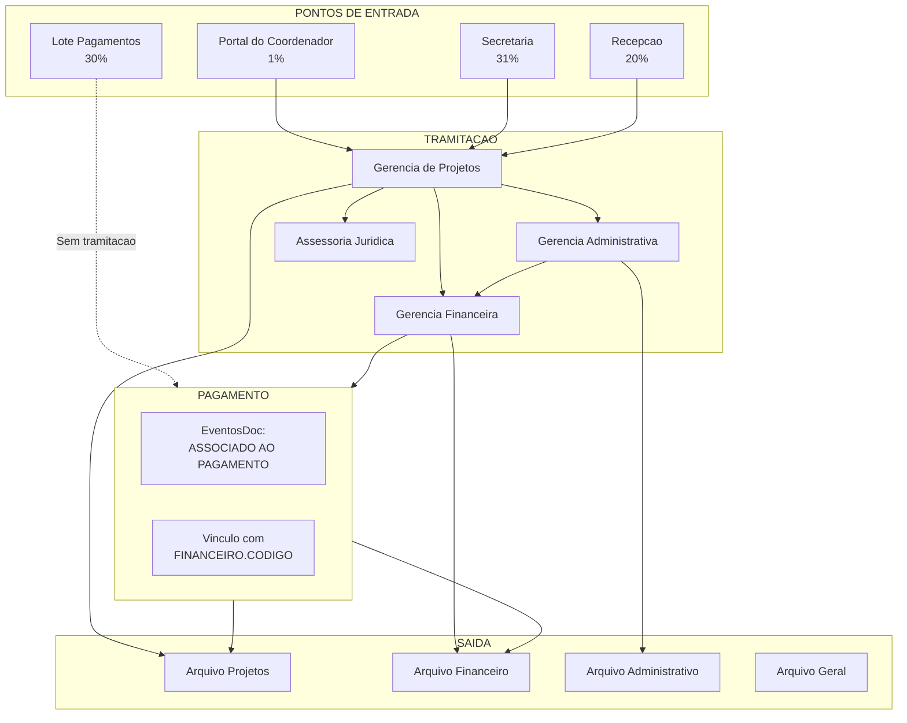

# Investigacao Avancada de Protocolos

> Gerado em: 2026-01-09 10:44:10
> Modo: SOMENTE LEITURA (SELECT)

---

## 1. Padroes de Vinculo MAE-FILHO nas Observacoes

### 1.1 Analise das Observacoes em scd_movimentacao

| Padrao                                 | Qtd Ocorrencias | Descricao                               |
| -------------------------------------- | --------------- | --------------------------------------- |
| Numero de protocolo (XXXX.XXXXXX.XXXX) | 40              | Referencias diretas a outros protocolos |
| 'PROTOCOLOS:'                          | 17              | Lista de protocolos                     |
| 'vinculado'                            | 1               | Mencao de vinculo                       |
| 'origem'                               | 19              | Referencia a protocolo de origem        |
| 'englobados'                           | 0               | Protocolos agrupados                    |
| 'referente'                            | 1               | Referencia a outro protocolo            |
| 'substituicao'                         | 2               | Protocolo substituido                   |

### 1.2 Exemplos de Vinculos Encontrados

#### Referencias Diretas a Outros Protocolos

**1. Protocolo `0175.040925.0025`** (PAGAMENTO BOLSISTAS)

- Referencias: `0153.210825.0005, 0153.210825.0005`
- Obs: _Protocolo de origem: 0153.210825.0005 a 0153.210825.0005..._

**2. Protocolo `0175.260825.0054`** (PAGAMENTO BOLSISTAS)

- Referencias: `3423.110825.0009, 3423.110825.0010`
- Obs: _Protocolo de origem: 3423.110825.0009 e 3423.110825.0010..._

**3. Protocolo `0175.260825.0036`** (PAGAMENTO BOLSISTAS)

- Referencias: `3423.110825.0004, 3423.110825.0006, 3423.150825.0002`
- Obs: _Protocolo de origem: 3423.110825.0004
  a 3423.110825.0006 e 3423.150825.0002..._

**4. Protocolo `0175.260825.0033`** (PAGAMENTO BOLSISTAS)

- Referencias: `3423.110825.0007, 3423.110825.0008, 3423.110825.0011`
- Obs: _Protocolos de origem: 3423.110825.0007, 3423.110825.0008
  e 3423.110825.0011..._

**5. Protocolo `None`** (REMANEJAMENTO DE RECURSOS)

- Referencias: `0153.110825.0015`
- Obs: _REMANEJAMENTO NÃO REALIZADO, POIS FOI SUBSTITUIDO PELO 0153.110825.0015..._

**6. Protocolo `None`** (SOLICITAÇÃO DO USO DE RENDIMEN)

- Referencias: `0153.110825.0015`
- Obs: _REMANEJAMENTO NÃO REALIZADO, POIS FOI SUBSTITUIDO PELO 0153.110825.0015..._

**7. Protocolo `0174.190825.0047`** (SOLICITAÇÃO DE PAGAMENTO - PF)

- Referencias: `4954.140825.0001, 4954.140825.0002`
- Obs: _PROTOCOLOS:4954.140825.0001 E 4954.140825.0002..._

**8. Protocolo `0175.150825.0062`** (PAGAMENTO BOLSISTAS)

- Referencias: `3423.110825.0001, 3423.110825.0003`
- Obs: _Protocolo de origem: 3423.110825.0001
  a 3423.110825.0003..._

**9. Protocolo `0174.140825.0041`** (SOLICITAÇÃO DE PAGAMENTO DE BO)

- Referencias: `0153.120825.0040, 0153.120825.0042`
- Obs: _PROTOCOLOS:0153.120825.0040 E 0153.120825.0042..._

**10. Protocolo `0175.130825.0041`** (PAGAMENTO BOLSISTAS)

- Referencias: `3423.300725.0001, 3423.250725.0002`
- Obs: _Protocolo de origem: 3423.300725.0001, 3423.250725.0002 e 3423..250725.0001..._

## 2. Relacao Portal do Coordenador com Financeiro

### 2.1 Protocolos do Portal com Pagamentos Associados

| Metrica                 | Valor     |
| ----------------------- | --------- |
| Protocolos do Portal    | 1,783     |
| Com pagamento associado | 28 (1.6%) |
| Total de pagamentos     | 34        |

### 2.2 Tempo Medio: Criacao no Portal ate Pagamento

| Metrica                            | Valor       |
| ---------------------------------- | ----------- |
| Tempo medio (criacao -> pagamento) | **44 dias** |
| Tempo minimo                       | 0 dias      |
| Tempo maximo                       | 114 dias    |
| Pagamentos analisados              | 34          |

### 2.3 Tipos de Solicitacao do Portal que Geram Pagamento

| Tipo de Solicitacao                           | Protocolos | Pagamentos | Media Pag/Prot |
| --------------------------------------------- | ---------- | ---------- | -------------- |
| NULL                                          | 15         | 12         | 0.80           |
| 33.90.39 - OUTROS SERVIÇOS DE TERCEIROS PESSO | 638        | 7          | 0.01           |
| 44.90.52 - EQUIPAMENTOS E MATERIAL PERMANENTE | 121        | 7          | 0.06           |
| 33.90.30 - MATERIAL DE CONSUMO                | 224        | 7          | 0.03           |
| 44.00.52 - EQUIPAMENTO E MATERIAL PERMANENTE  | 3          | 1          | 0.33           |
| SOLICITAÇÃO DE PASSAGEM                       | 6          | 0          | 0.00           |
| 33.90.49 - AUXÍLIO TRANSPORTE                 | 2          | 0          | 0.00           |
| 33.90.31 - PREMIAÇÕES CULTURAIS, ART., CIENT. | 1          | 0          | 0.00           |
| SOLICITAÇÃO DE COMPRA MAT PERMANENTE          | 6          | 0          | 0.00           |
| SOLICITAÇÃO DE COMPRAS/CONSUMO                | 6          | 0          | 0.00           |
| 33.90.18 - BOLSA                              | 3          | 0          | 0.00           |
| 33.00.39 - OUTROS SERVIÇOS DE TERCEIROS - PES | 82         | 0          | 0.00           |
| 33.90.36 - OUTROS SERVIÇOS DE TERCEIROS PESSO | 23         | 0          | 0.00           |
| 33.90.14 - DIÁRIAS                            | 9          | 0          | 0.00           |
| 33.90.20 - BOLSAS PESQUISADOR                 | 5          | 0          | 0.00           |

## 3. Fluxo Completo: Portal do Coordenador ate Pagamento

### 3.1 Exemplo de Protocolo do Portal com Pagamento

**Protocolo**: `1431.290825.0001`

- NumeroControle: `WEB:19175/2025`
- Assunto:
- Remetente:
- Data Criacao: 29/08/2025
- Convenio: 3831438

**Historico de Movimentacoes:**

| #   | Data       | Hora  | Origem               | Destino              | Recebido |
| --- | ---------- | ----- | -------------------- | -------------------- | -------- |
| 1   | 29/08/2025 | 15:16 | ENTRADA              | - GERÊNCIA DE PROJET | Nao      |
| 2   | 01/09/2025 | 15:23 | - GERÊNCIA DE PROJET | - GERENCIA DE FINANÇ | Sim      |

**Eventos:**

| Data       | Evento                                                                         |
| ---------- | ------------------------------------------------------------------------------ |
| 29/08/2025 | DOCUMENTO\PROTOCOLO CADASTRADO NO SISTEMA...                                   |
| 01/09/2025 | Requisição liberada para a instituição pelo usuário Patrícia Xavier Chaves.... |
| 01/09/2025 | PROTOCOLO/PROCESSO ASSOCIADO AO PAGAMENTO DE NÚMERO 4210539...                 |
| 01/09/2025 | CONFIRMAÇÃO DA RECEPÇÃO DO PROTOCOLO/PROCESSO EFETUADA...                      |

## 4. Protocolos Sem Movimentacao

### 4.1 Volume e Distribuicao

- **Total sem movimentacao**: 52,253 (29.75%)

### 4.2 Tipos de Protocolo Sem Movimentacao

| Tipo de Protocolo                 | Qtd    | %      |
| --------------------------------- | ------ | ------ |
| LOTE DE PAGAMENTOS                | 52,250 | 99.99% |
| SOLICITAÇÃO DE PAGAMENTO DE BOLSA | 2      | 0.00%  |
| NULL                              | 1      | 0.00%  |

### 4.3 Protocolos Sem Movimentacao por Origem

| Origem             | Qtd Sem Movimentacao |
| ------------------ | -------------------- |
| LOTE DE PAGAMENTOS | 52,250               |
| TRADICIONAL        | 3                    |

### 4.4 Protocolos Sem Movimentacao MAS com Pagamento

- Protocolos sem movimentacao mas COM pagamento associado: **1**
- _Isso indica que o pagamento pode ser associado independente da tramitacao_

## 5. Tempo de Tramitacao por Tipo de Protocolo

### 5.1 Tempo Medio de Arquivamento por Tipo de Assunto

| Tipo de Protocolo                        | Qtd Arquivados | Media (dias) | Min | Max |
| ---------------------------------------- | -------------- | ------------ | --- | --- |
| SOLICITAÇÃO DE PASSAGEM                  | 993            | 295          | 1   | 833 |
| SOLICITAÇÃO DE COMPRA MAT PERMANENTE     | 125            | 211          | 1   | 515 |
| SOLICITAÇÃO DE SERVIÇOS - PJ             | 1,087          | 204          | 0   | 831 |
| SOLICITAÇÃO DE COMPRAS/CONSUMO           | 511            | 201          | 7   | 820 |
| REMANEJAMENTO DE RECURSOS                | 454            | 189          | 0   | 829 |
| SOLICITAÇÃO DE SERVIÇOS - PF             | 52             | 185          | 5   | 712 |
| SOLICITAÇÃO DE PAGAMENTO DE DIÁRIAS      | 8,462          | 168          | 0   | 831 |
| SOLICITAÇÃO DE PAGAMENTO                 | 108            | 167          | 2   | 707 |
| SOLICITAÇÃO DE PAGAMENTO DE BOLSA        | 8,507          | 162          | 0   | 831 |
| SOLICITAÇÃO DE PAGAMENTO - PJ            | 244            | 160          | 0   | 827 |
| SOLICITAÇÃO DE PAGAMENTO - PF            | 1,787          | 155          | 1   | 832 |
| SOLICITAÇÃO DE SUPRIMENTO DE FUNDOS      | 840            | 152          | 4   | 831 |
| DEVOLUÇÃO DE DIÁRIA                      | 79             | 150          | 2   | 421 |
| DECLARAÇÃO                               | 53             | 150          | 61  | 822 |
| PRESTAÇÃO DE CONTAS DO SUPRIMENTO DE FUN | 856            | 137          | 0   | 644 |

### 5.2 Tempo por Origem (Portal vs Tradicional)

| Origem      | Qtd Arquivados | Tempo Medio (dias) |
| ----------- | -------------- | ------------------ |
| PORTAL      | 727            | 81                 |
| TRADICIONAL | 36,858         | 152                |

## 6. Analise de Reapresentacoes (Protocolo gerando outro)

### 6.1 Volume de Reapresentacoes

| Metrica                             | Valor                      |
| ----------------------------------- | -------------------------- |
| Total de eventos de reapresentacao  | 1,755                      |
| Protocolos MAE (que geraram filhos) | 1,075                      |
| Primeiro evento                     | 2013-10-07 16:55:29.367000 |
| Ultimo evento                       | 2025-09-05 15:52:26.287000 |

### 6.2 Motivos de Reapresentacao (Analise de Texto)

- Vinculos MAE-FILHO extraidos: **198**

**Exemplos de Reapresentacao:**

| Protocolo MAE    | Protocolo FILHO  | Assunto                        |
| ---------------- | ---------------- | ------------------------------ |
| 3075.250825.0087 | 0165.290825.0052 | BOLSA                          |
| 2577.260825.0016 | 0165.270825.0062 | 33.90.18 - BOLSA               |
| 0153.250825.0090 | 0153.250825.0090 | SOLICITAÇÃO DE PAGAMENTO DE BO |
| 0153.220825.0029 | 0153.220825.0029 | SOLICITAÇÃO DE PAGAMENTO DE BO |
| 6088.250825.0004 | 0184.260825.0028 | 33.90.20 - BOLSAS PESQUISADOR  |
| 6088.250825.0015 | 0184.260825.0028 | 33.90.20 - BOLSAS PESQUISADOR  |
| 6088.250825.0007 | 0184.260825.0028 | 33.90.20 - BOLSAS PESQUISADOR  |
| 3075.230725.0086 | 0165.290825.0038 | BOLSA                          |
| 3075.230725.0050 | 0165.290825.0038 | BOLSA                          |
| 0153.220825.0046 | 0066.250825.0060 | SOLICITAÇÃO DE PAGAMENTO - MIG |
| 0066.060825.0114 | 0066.060825.0114 | SOLICITAÇÕES DE PAGAMENTO DE B |
| 1184.200825.0010 | 0176.210825.0040 | 33.90.14 - DIÁRIAS             |
| 2577.200825.0005 | 0154.200825.0077 | 33.90.18 - BOLSA               |
| 2577.200825.0001 | 0154.200825.0077 | 33.90.18 - BOLSA               |
| 2577.200825.0008 | 0154.200825.0077 | 33.90.18 - BOLSA               |

## 7. Fluxo Principal por Tipo de Assunto

### 7.1 Fluxo: BOLSA

| Origem (1a mov)        | Destino                  | Qtd    |
| ---------------------- | ------------------------ | ------ |
| ENTRADA                | - GERÊNCIA DE PROJETOS   | 14,168 |
| - SECRETARIA           | - GERÊNCIA DE PROJETOS   | 8,443  |
| - GERÊNCIA DE PROJETOS | - GERENCIA DE FINANÇAS E | 1,166  |
| - GERÊNCIA DE PROJETOS | - GERÊNCIA DE PROJETOS   | 1,118  |
| ENTRADA                | DESABILITADO COORDENAÇÃO | 26     |

### 7.2 Fluxo: DIARIA

| Origem (1a mov)        | Destino                  | Qtd |
| ---------------------- | ------------------------ | --- |
| - RECEPÇÃO             | DESABILITADO GERÊNCIA DE | 6   |
| - GERÊNCIA DE PROJETOS | - GERENCIA DE FINANÇAS E | 2   |
| - GERÊNCIA DE PROJETOS | DESABILITADO GERÊNCIA DE | 1   |
| - GERÊNCIA DE PROJETOS | - GERÊNCIA DE PROJETOS   | 1   |
| - RECEPÇÃO             | DESABILITADO COORDENAÇÃO | 1   |

### 7.3 Fluxo: PAGAMENTO PF

| Origem (1a mov)           | Destino                   | Qtd   |
| ------------------------- | ------------------------- | ----- |
| - SECRETARIA              | - GERÊNCIA DE PROJETOS    | 1,641 |
| - GERÊNCIA DE PROJETOS    | - GERENCIA DE FINANÇAS E  | 300   |
| - GERÊNCIA DE PROJETOS    | - GERÊNCIA DE PROJETOS    | 197   |
| DESABILITADO SECRETARIA D | DESABILITADO COORDENAÇÃO  | 2     |
| - GERÊNCIA DE PROJETOS    | - GERÊNCIA ADMINISTRATIVA | 2     |

### 7.4 Fluxo: PAGAMENTO PJ

| Origem (1a mov)        | Destino                   | Qtd   |
| ---------------------- | ------------------------- | ----- |
| - SECRETARIA           | - GERÊNCIA DE PROJETOS    | 1,411 |
| - GERÊNCIA DE PROJETOS | - GERÊNCIA DE PROJETOS    | 186   |
| - GERÊNCIA DE PROJETOS | - GERENCIA DE FINANÇAS E  | 36    |
| - GERÊNCIA DE PROJETOS | - GERÊNCIA ADMINISTRATIVA | 33    |
| - SECRETARIA           | - GERÊNCIA ADMINISTRATIVA | 21    |

### 7.5 Fluxo: PASSAGEM

| Origem (1a mov)        | Destino                   | Qtd |
| ---------------------- | ------------------------- | --- |
| - SECRETARIA           | - GERÊNCIA DE PROJETOS    | 849 |
| - GERÊNCIA DE PROJETOS | - GERÊNCIA DE PROJETOS    | 88  |
| - GERÊNCIA DE PROJETOS | - GERÊNCIA ADMINISTRATIVA | 87  |
| - SECRETARIA           | - GERÊNCIA ADMINISTRATIVA | 10  |
| - GERÊNCIA DE PROJETOS | - GERENCIA DE FINANÇAS E  | 5   |

### 7.6 Fluxo: MATERIAL

| Origem (1a mov)           | Destino                   | Qtd |
| ------------------------- | ------------------------- | --- |
| ENTRADA                   | - GERÊNCIA DE PROJETOS    | 487 |
| - GERÊNCIA DE PROJETOS    | - GERÊNCIA DE PROJETOS    | 119 |
| ENTRADA                   | DESABILITADO COORDENAÇÃO  | 16  |
| - GERÊNCIA DE PROJETOS    | - GERÊNCIA ADMINISTRATIVA | 4   |
| - GERÊNCIA ADMINISTRATIVA | - GERÊNCIA ADMINISTRATIVA | 2   |

## 8. Diagrama: Fluxo Geral de Protocolos

