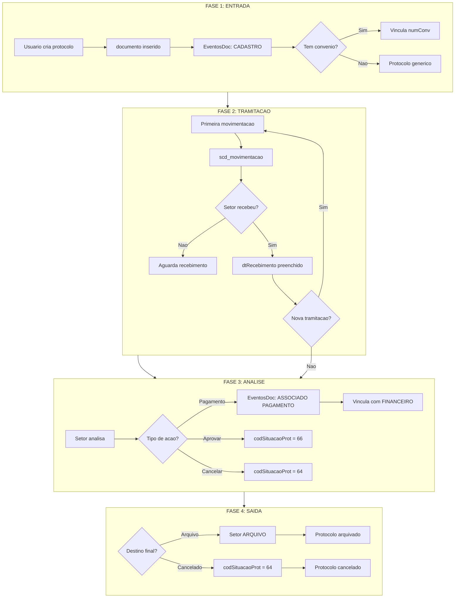

# Resumo Executivo: Ciclo de Vida de Protocolos SAGI/FADEX

> Data: 2026-01-09
> Modo: SOMENTE LEITURA (SELECT)

---

## Visao Geral

O ciclo de vida de um protocolo no sistema SAGI e composto por **4 fases** principais:

```
┌──────────┐    ┌──────────────┐    ┌──────────────┐    ┌──────────────┐
│ ENTRADA  │───►│  TRAMITACAO  │───►│   ANALISE    │───►│    SAIDA     │
│(Cadastro)│    │(Movimentacao)│    │ (Decisao)    │    │(Arquivamento)│
└──────────┘    └──────────────┘    └──────────────┘    └──────────────┘
     │                 │                   │                  │
     ▼                 ▼                   ▼                  ▼
 documento       scd_movimentacao    situacaoProtocolo   SETOR.arquivo
 EventosDoc      EventosDoc         EventosDoc          EventosDoc
```

---

## FASE 1: ENTRADA (Cadastro)

### Tabela Principal

- **documento** - 175.635 protocolos ativos

### Como funciona

1. Usuario cria protocolo via sistema SAGI
2. Registro inserido na tabela `documento`
3. Evento registrado em `EventosDoc` (CADASTRO INICIAL)
4. Numero gerado automaticamente: `XXXX.AAMMDD.NNNN`

### Descobertas

| Metrica                 | Valor                             |
| ----------------------- | --------------------------------- |
| Protocolos com convenio | 66,68%                            |
| Protocolos sem convenio | 33,32%                            |
| codSetorCad preenchido  | **0,01%** (campo quase nao usado) |

### Top 5 Tipos de Protocolo

1. LOTE DE PAGAMENTOS (29,75%)
2. SOLICITACAO DE PAGAMENTO DE BOLSA (7,86%)
3. SOLICITACAO DE PAGAMENTO DE DIARIAS (7,12%)
4. BOLSA (3,25%)
5. SOLICITACAO DE PAGAMENTO PF (3,19%)

---

## FASE 2: TRAMITACAO (Movimentacao)

### Tabela Principal

- **scd_movimentacao** - 248.325 movimentacoes ativas

### Como funciona

1. Usuario despacha protocolo para outro setor
2. Registro inserido em `scd_movimentacao`
3. Setor destino recebe e preenche `dtRecebimento`
4. Processo pode repetir varias vezes

### Descobertas

| Metrica                          | Valor  |
| -------------------------------- | ------ |
| Media de movimentacoes/protocolo | 2,01   |
| Protocolos com 1 movimentacao    | 29,76% |
| Protocolos com 2 movimentacoes   | 48,57% |
| Protocolos com 3-5 movimentacoes | 20,54% |

### Fluxo Tipico (mais comum)

```
SECRETARIA
    │
    ▼
GERENCIA DE PROJETOS (43.528 mov)
    │
    ├──► GERENCIA DE FINANCAS (17,53%)
    │         │
    │         ▼
    │    ARQUIVO (5,53%) ou ARQUIVO FINANCEIRO (4,01%)
    │
    └──► ARQUIVO GERENCIA DE PROJETOS (3,79%)
```

### Tempo Medio em Cada Setor (2020-2025)

| Setor                                | Media (dias) |
| ------------------------------------ | ------------ |
| GERENCIA DE FINANCAS E CONTABILIDADE | 339          |
| ARQUIVO                              | 334          |
| ARQUIVO FINANCEIRO                   | 265          |
| GERENCIA ADMINISTRATIVA              | 199          |
| GERENCIA DE PROJETOS                 | 104          |

---

## FASE 3: ANALISE (Decisoes)

### Tabela Principal

- **situacaoProtocolo** - 70 situacoes cadastradas

### Como funciona

1. Setor analisa o protocolo
2. Define situacao via `codSituacaoProt`
3. Eventos de pagamento registrados em `EventosDoc`

### ALERTA CRITICO

| Problema                                       | Impacto                               |
| ---------------------------------------------- | ------------------------------------- |
| **91,33% das movimentacoes tem situacao NULL** | Impossivel rastrear status real       |
| Apenas 8,62% tem "EM ANALISE" (codigo 66)      | Unica situacao utilizada regularmente |

### Situacoes Mais Utilizadas

| Codigo | Situacao   | Qtd Uso |
| ------ | ---------- | ------- |
| 66     | EM ANALISE | 21.408  |
| 64     | CANCELADO  | 49      |
| 61     | PAGAMENTO  | 18      |
| 56     | APROVADO   | 14      |

### Vinculos com Financeiro

- **33,1% dos protocolos** tem vinculo com pagamento
- Total de vinculos: 212.031
- Media de 3,6 pagamentos por protocolo vinculado

---

## FASE 4: SAIDA (Arquivamento)

### Setores de Arquivo

| Setor                        | Codigo |
| ---------------------------- | ------ |
| ARQUIVO                      | 52     |
| ARQUIVO GERENCIA DE PROJETOS | 53     |
| ARQUIVO FINANCEIRO           | 54     |
| ARQUIVO ADMINISTRATIVO       | 55     |

### Distribuicao de Saidas

| Tipo                                    | %        |
| --------------------------------------- | -------- |
| EM TRAMITACAO (ainda em setores ativos) | **~55%** |
| ARQUIVADO (setores de arquivo)          | **~31%** |
| EM SETORES DESABILITADOS                | **~14%** |

### Tempo do Ciclo de Vida (Criacao -> Arquivamento)

| Faixa        | %      |
| ------------ | ------ |
| 0-7 dias     | 14,23% |
| 8-30 dias    | 21,15% |
| 31-90 dias   | 19,95% |
| 91-180 dias  | 9,66%  |
| 181-365 dias | 19,75% |
| 365+ dias    | 15,28% |

---

## EVENTOS Durante o Ciclo de Vida

### Tabela Principal

- **EventosDoc** - 399.876 eventos

### Tipos de Eventos

| Tipo                   | Qtd     | %      |
| ---------------------- | ------- | ------ |
| ASSOCIADO AO PAGAMENTO | 212.031 | 53,02% |
| OUTROS (diversos)      | 162.641 | 40,67% |
| CADASTRO INICIAL       | 21.407  | 5,35%  |
| FOI REAPRESENTADO      | 1.755   | 0,44%  |
| CANCELAMENTO           | 1.505   | 0,38%  |
| ARQUIVAMENTO           | 534     | 0,13%  |

---

## Diagrama Mermaid do Ciclo Completo



---

## PROBLEMAS IDENTIFICADOS

### 1. Situacao de Protocolo NAO Preenchida

- **91,33%** das movimentacoes tem `codSituacaoProt = NULL`
- Impossivel saber o status real de um protocolo pela situacao

### 2. Setores Desabilitados com Protocolos

- **~85.000 protocolos** estao em setores DESABILITADOS
- Media de 3.000+ dias parados nesses setores
- Protocolos "orfaos" sem destino

### 3. Campo codSetorCad Nao Utilizado

- **99,99%** dos protocolos tem `codSetorCad = NULL`
- Setor de cadastro deve ser inferido pela primeira movimentacao

### 4. Protocolos Sem Movimentacao

- **52.253 protocolos** (29,75%) nunca tiveram movimentacao
- Maioria sao "LOTE DE PAGAMENTOS" automaticos

### 5. Tabela scd_movimentacaoItem VAZIA

- Deveria conter vinculos mae/filho
- Tem **0 registros**
- Relacionamentos via texto em EventosDoc

---

## QUERIES UTEIS

### Rastrear Ciclo Completo

```sql
DECLARE @NumeroProtocolo VARCHAR(50) = '0153.250325.0049';

-- Dados do protocolo
SELECT d.numero, d.assunto, d.data, d.numConv
FROM documento d WHERE d.numero = @NumeroProtocolo;

-- Historico de movimentacoes
SELECT m.data, so.DESCR AS origem, sd.DESCR AS destino, sp.descricao AS situacao
FROM scd_movimentacao m
LEFT JOIN SETOR so ON m.codSetorOrigem = so.CODIGO
LEFT JOIN SETOR sd ON m.codSetorDestino = sd.CODIGO
LEFT JOIN situacaoProtocolo sp ON m.codSituacaoProt = sp.codigo
WHERE m.numDocumento = @NumeroProtocolo
ORDER BY m.data;

-- Eventos
SELECT e.Data, e.Descricao FROM EventosDoc e
INNER JOIN documento d ON e.CodProt = d.Codigo
WHERE d.numero = @NumeroProtocolo;
```

### Protocolos por Fase

```sql
WITH UltimaMovimentacao AS (
    SELECT CodProt, codSetorDestino, codSituacaoProt,
           ROW_NUMBER() OVER (PARTITION BY CodProt ORDER BY data DESC) AS rn
    FROM scd_movimentacao WHERE Deletado IS NULL OR Deletado = 0
)
SELECT
    CASE
        WHEN s.DESCR LIKE '%ARQUIVO%' THEN 'ARQUIVADO'
        WHEN s.DESCR LIKE '%FINANC%' THEN 'EM FINANCEIRO'
        WHEN s.DESCR LIKE '%PROJET%' THEN 'EM PROJETOS'
        ELSE 'EM TRAMITACAO'
    END AS fase,
    COUNT(*) AS qtd
FROM UltimaMovimentacao um
LEFT JOIN SETOR s ON um.codSetorDestino = s.CODIGO
WHERE um.rn = 1
GROUP BY CASE
    WHEN s.DESCR LIKE '%ARQUIVO%' THEN 'ARQUIVADO'
    WHEN s.DESCR LIKE '%FINANC%' THEN 'EM FINANCEIRO'
    WHEN s.DESCR LIKE '%PROJET%' THEN 'EM PROJETOS'
    ELSE 'EM TRAMITACAO'
END;
```

---

## ARQUIVOS RELACIONADOS

| Arquivo                                      | Descricao                     |
| -------------------------------------------- | ----------------------------- |
| `docs/INVESTIGACAO_CICLO_VIDA_PROTOCOLO.md`  | Analise detalhada completa    |
| `03_modulos/MODULO_PROTOCOLO.md`             | Documentacao do modulo        |
| `tabelas/TABELA_documento.md`                | Estrutura tabela documento    |
| `tabelas/TABELA_scd_movimentacao.md`         | Estrutura tabela movimentacao |
| `tabelas/TABELA_EventosDoc.md`               | Estrutura tabela eventos      |
| `sql_queries/QUERIES_PROTOCOLO_COMPLETO.md`  | 18 queries prontas            |
| `scripts/investigar_ciclo_vida_protocolo.py` | Script de investigacao        |

---

## RECOMENDACOES

### Curto Prazo

1. Criar processo para migrar protocolos de setores DESABILITADOS
2. Implementar preenchimento obrigatorio de `codSituacaoProt`
3. Documentar fluxos oficiais de tramitacao

### Medio Prazo

4. Criar dashboard de acompanhamento de ciclo de vida
5. Implementar alertas para protocolos parados >30 dias
6. Normalizar dados de situacao existentes

### Longo Prazo

7. Popular tabela `scd_movimentacaoItem` com relacionamentos
8. Implementar workflow automatizado de tramitacao
9. Criar API para consulta de status em tempo real

---

> **Modo de operacao**: SOMENTE LEITURA (SELECT)
> **Gerado por**: Engenharia de Dados - Claude Code
> **Versao**: 1.0
